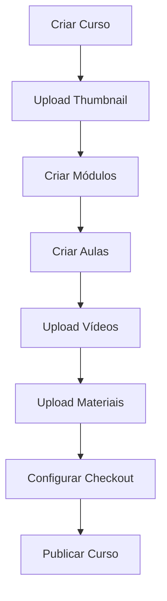
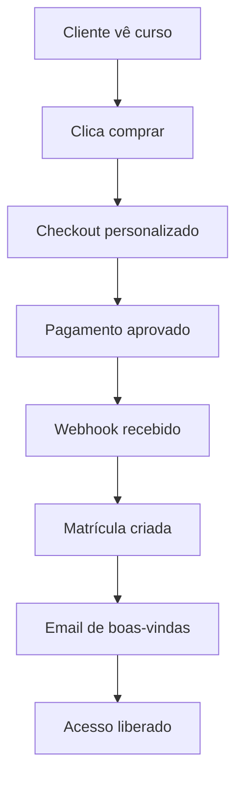
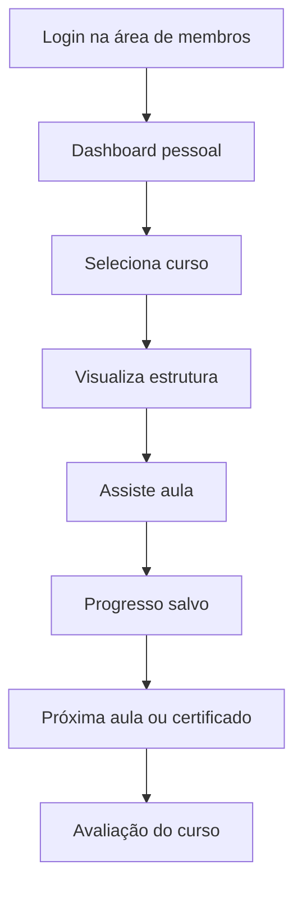
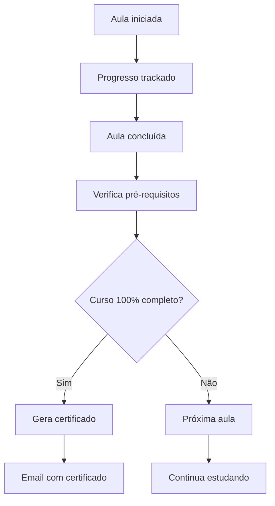

# APIs do Backend Necessárias para o Sistema Completo de Cursos

## 🚨 ANÁLISE DA ÁREA DE MEMBROS - STATUS ATUAL

### ✅ Já Implementado:
1. **Player de Vídeo** (`VideoPlayer.jsx`) - ✅ Completo
   - Reprodução com Plyr
   - Controles customizados
   - Progresso automático
   - Bookmarks
   - Marcação automática de conclusão (90%)

2. **Interface de Curso** (`CourseViewPage.jsx`) - ✅ Completo
   - Layout responsivo
   - Lista de módulos e aulas
   - Progresso visual
   - Informações do curso

3. **Sistema de Comentários** - ✅ Básico implementado
   - Campo para adicionar comentários
   - Lista de comentários existentes
   - Interface visual pronta

4. **Área de Membros** (`MembersAreaPage.jsx`) - ✅ Dashboard implementado
   - Interface Netflix-style
   - Carrosséis de conteúdo
   - Sistema de temas
   - Continue assistindo

### ❌ FALTANDO IMPLEMENTAR:

#### 1. Sistema de Downloads de Materiais
**Componentes que precisam ser criados:**
```jsx
// src/components/course/LessonResources.jsx
- Lista de arquivos para download
- Botões de download por arquivo
- Verificação de permissões
- Indicador de progresso de download

// src/components/course/CourseDownloads.jsx  
- Central de downloads do curso
- Arquivos por módulo/aula
- Downloads em lote
- Histórico de downloads
```

#### 2. Sistema de Discussões/Fórum Completo
**Componentes que precisam ser criados:**
```jsx
// src/components/course/LessonDiscussion.jsx
- Sistema de tópicos por aula
- Respostas aninhadas
- Sistema de curtidas
- Moderação de conteúdo

// src/components/course/CourseForumPage.jsx
- Fórum geral do curso
- Categorias de discussão
- Sistema de tags
- Pesquisa de tópicos
```

#### 3. Sistema de Perguntas e Respostas (Q&A)
**Componentes que precisam ser criados:**
```jsx
// src/components/course/QASection.jsx
- Seção de perguntas por aula
- Respostas do instrutor destacadas
- Sistema de votação em perguntas
- Filtros (respondidas/não respondidas)

// src/components/course/QAModeration.jsx
- Interface para instrutores
- Moderação de perguntas
- Respostas rápidas/templates
```

#### 4. Sistema de Progresso Detalhado
**Componentes que precisam ser criados:**
```jsx
// src/components/course/ProgressTracker.jsx
- Dashboard de progresso do aluno
- Estatísticas detalhadas
- Metas e objetivos
- Gamificação (badges, pontos)

// src/components/course/CourseAnalytics.jsx
- Tempo assistido por aula
- Análise de engajamento
- Relatórios de progresso
```

#### 5. Sistema de Certificados
**Componentes que precisam ser criados:**
```jsx
// src/components/course/CertificateGenerator.jsx
- Geração automática de certificados
- Templates personalizáveis
- Download em PDF
- Verificação de autenticidade
```

#### 6. Sistema de Notas Pessoais
**Componentes que precisam ser criados:**
```jsx
// src/components/course/LessonNotes.jsx
- Editor de notas por aula
- Timestamps automáticos
- Pesquisa em notas
- Exportação de notas
```

#### 7. Sistema de Avaliações/Quiz
**Componentes que precisam ser criados:**
```jsx
// src/components/course/LessonQuiz.jsx
- Quiz por aula/módulo
- Múltipla escolha, verdadeiro/falso
- Feedback imediato
- Sistema de pontuação

// src/components/course/CourseExam.jsx
- Prova final do curso
- Limite de tempo
- Certificação condicional
```

## 🎓 CRIAÇÃO E GESTÃO DE CURSOS

### 1. Criar Curso
```
POST /api/courses
Headers: Authorization: Bearer {token}
Body: {
  "title": "JavaScript Avançado",
  "description": "Curso completo de JavaScript",
  "shortDescription": "JavaScript do zero ao avançado",
  "thumbnailUrl": "https://cdn.exemplo.com/thumb.jpg",
  "price": 199.90,
  "category": "Programação",
  "level": "intermediate",
  "language": "pt-BR",
  "tags": ["javascript", "programação"],
  "requirements": ["Conhecimento básico de HTML"],
  "whatYouWillLearn": ["Criar aplicações web", "Usar frameworks"],
  "status": "draft",
  "hasLifetimeAccess": true,
  "allowDownloads": true,
  "hasCertificate": false,
  "maxStudents": null,
  "useCustomCheckout": false,
  "checkoutTheme": "default",
  "orderBumpEnabled": false,
  "upsellEnabled": false,
  "seoTitle": "Curso JavaScript Avançado",
  "seoDescription": "Aprenda JavaScript do zero",
  "seoKeywords": ["javascript", "curso"],
  "slug": "javascript-avancado"
}
```

**Resposta de Sucesso:**
```json
{
  "success": true,
  "course": {
    "id": "course_123",
    "title": "JavaScript Avançado",
    "slug": "javascript-avancado",
    "status": "draft",
    "createdAt": "2024-01-15T10:30:00Z",
    "modules": []
  }
}
```

### 2. Atualizar Curso
```
PUT /api/courses/{courseId}
Headers: Authorization: Bearer {token}
Body: {Mesma estrutura do POST}
```

### 3. Buscar Curso Específico
```
GET /api/courses/{courseId}
Headers: Authorization: Bearer {token}
```

**Resposta:**
```json
{
  "id": "course_123",
  "title": "JavaScript Avançado",
  "description": "Curso completo...",
  "modules": [
    {
      "id": "module_456",
      "title": "Módulo 1: Introdução",
      "description": "Conceitos básicos",
      "order": 0,
      "lessons": [
        {
          "id": "lesson_789",
          "title": "Aula 1: Variáveis",
          "description": "Tipos de variáveis",
          "type": "video",
          "order": 0,
          "duration": 900,
          "videoUrl": "https://cdn.exemplo.com/video.mp4",
          "materials": [
            {
              "id": "material_101",
              "name": "Slides da aula",
              "url": "https://cdn.exemplo.com/slides.pdf",
              "type": "pdf"
            }
          ],
          "isPreview": false,
          "isPublished": true
        }
      ],
      "isPublished": true
    }
  ],
  "instructor": {
    "id": "user_123",
    "name": "João Silva",
    "email": "joao@exemplo.com"
  },
  "stats": {
    "totalEnrollments": 150,
    "averageRating": 4.5,
    "totalRevenue": 29985.00
  }
}
```

### 4. Listar Cursos do Instrutor
```
GET /api/courses?instructor_id={userId}
Headers: Authorization: Bearer {token}
Query: ?page=1&limit=10&status=published&category=programacao
```

### 5. Deletar Curso
```
DELETE /api/courses/{courseId}
Headers: Authorization: Bearer {token}
```

## 📂 UPLOAD DE ARQUIVOS

### 6. Upload de Arquivos para Curso
```
POST /api/courses/upload
Headers: Authorization: Bearer {token}, Content-Type: multipart/form-data
Body: FormData {
  file: File,
  type: "thumbnail" | "video" | "material",
  courseId: "course_123"
}
```

**Resposta:**
```json
{
  "success": true,
  "url": "https://cdn.exemplo.com/uploads/video_456.mp4",
  "type": "video",
  "duration": 1800,
  "size": 157286400,
  "filename": "aula-01.mp4"
}
```

## 📝 GERENCIAMENTO DE MÓDULOS

### 7. Criar Módulo
```
POST /api/courses/{courseId}/modules
Headers: Authorization: Bearer {token}
Body: {
  "title": "Módulo 1: Introdução",
  "description": "Conceitos fundamentais",
  "order": 0
}
```

### 8. Atualizar Módulo
```
PUT /api/courses/{courseId}/modules/{moduleId}
Headers: Authorization: Bearer {token}
Body: {
  "title": "Módulo Atualizado",
  "description": "Nova descrição",
  "isPublished": true
}
```

### 9. Deletar Módulo
```
DELETE /api/courses/{courseId}/modules/{moduleId}
Headers: Authorization: Bearer {token}
```

## 🎬 GERENCIAMENTO DE AULAS

### 10. Criar Aula
```
POST /api/courses/{courseId}/modules/{moduleId}/lessons
Headers: Authorization: Bearer {token}
Body: {
  "title": "Aula 1: Variáveis",
  "description": "Tipos de variáveis em JavaScript",
  "type": "video",
  "order": 0,
  "videoUrl": "https://cdn.exemplo.com/video.mp4",
  "duration": 900,
  "isPreview": false
}
```

### 11. Atualizar Aula
```
PUT /api/courses/{courseId}/modules/{moduleId}/lessons/{lessonId}
Headers: Authorization: Bearer {token}
Body: {Mesma estrutura do POST}
```

### 12. Deletar Aula
```
DELETE /api/courses/{courseId}/modules/{moduleId}/lessons/{lessonId}
Headers: Authorization: Bearer {token}
```

## 🎓 SISTEMA DE MATRÍCULAS (Mantido do documento anterior)

### 13. Verificar Status de Matrícula
```
GET /api/courses/{courseId}/enrollment/status
Headers: Authorization: Bearer {token}
```

### 14. Realizar Matrícula
```
POST /api/courses/{courseId}/enroll
Headers: Authorization: Bearer {token}
Body: {
  "paymentMethod": "checkout" | "direct",
  "productId": "prod_123"
}
```

### 15. Webhook de Pagamento Aprovado
```
POST /api/webhooks/payment/success
Headers: X-Webhook-Secret: {secret}
Body: {
  "paymentId": "pay_123456",
  "userId": "user_789",
  "productId": "prod_course_123",
  "courseId": "course_123",
  "amount": 199.90,
  "currency": "BRL"
}
```

## 🔐 ACESSO AO CONTEÚDO

### 16. Verificar Acesso a Aula
```
GET /api/courses/{courseId}/lessons/{lessonId}/access
Headers: Authorization: Bearer {token}
```

**Resposta:**
```json
{
  "hasAccess": true,
  "accessType": "full",
  "downloadAllowed": true,
  "streamUrl": "https://stream.exemplo.com/secure/lesson_789",
  "lesson": {
    "id": "lesson_789",
    "title": "Aula 1: Variáveis",
    "description": "Tipos de variáveis em JavaScript",
    "type": "video",
    "duration": 900,
    "isCompleted": false,
    "watchedPercentage": 45,
    "lastPosition": 405,
    "materials": [
      {
        "id": "material_101",
        "name": "Slides da aula",
        "url": "https://cdn.exemplo.com/materials/slides.pdf",
        "type": "pdf",
        "size": 2048576
      }
    ]
  },
  "nextLesson": {
    "id": "lesson_790",
    "title": "Aula 2: Funções",
    "hasAccess": true
  },
  "prevLesson": {
    "id": "lesson_788",
    "title": "Introdução",
    "hasAccess": true
  }
}
```

### 17. Obter URL de Stream/Download
```
GET /api/courses/{courseId}/lessons/{lessonId}/media?type=stream
Headers: Authorization: Bearer {token}
```

**Resposta:**
```json
{
  "url": "https://stream.exemplo.com/secure/xyz123?token=abc456",
  "expiresAt": "2024-01-15T12:00:00Z",
  "type": "stream",
  "quality": "1080p",
  "watermark": true,
  "allowDownload": false
}
```

## 📈 PROGRESSO E ANALYTICS

### 18. Progresso do Curso
```
GET /api/courses/{courseId}/progress
Headers: Authorization: Bearer {token}
```

**Resposta:**
```json
{
  "course": {
    "id": "course_123",
    "title": "JavaScript Avançado",
    "description": "Curso completo de JavaScript",
    "thumbnailUrl": "https://cdn.exemplo.com/thumb.jpg",
    "instructor": {
      "name": "João Silva",
      "avatar": "https://cdn.exemplo.com/avatar.jpg"
    },
    "totalDuration": 18000,
    "certificateAvailable": true
  },
  "enrollment": {
    "enrolledAt": "2024-01-15T10:30:00Z",
    "expiresAt": "2024-12-31T23:59:59Z",
    "status": "active"
  },
  "progress": {
    "totalLessons": 20,
    "completedLessons": 13,
    "progressPercentage": 65,
    "timeSpent": 7200,
    "estimatedTimeToComplete": 3600,
    "lastAccessed": "2024-01-20T15:45:00Z",
    "completionDate": null,
    "certificateEarned": false
  },
  "modules": [
    {
      "id": "module_456",
      "title": "Módulo 1: Introdução",
      "description": "Conceitos básicos",
      "order": 0,
      "totalLessons": 5,
      "completedLessons": 5,
      "isCompleted": true,
      "lessons": [
        {
          "id": "lesson_789",
          "title": "Aula 1: Variáveis",
          "type": "video",
          "duration": 900,
          "order": 0,
          "isCompleted": true,
          "completedAt": "2024-01-15T11:00:00Z",
          "timeSpent": 900,
          "watchedPercentage": 100,
          "isPreview": false,
          "hasAccess": true
        }
      ]
    }
  ],
  "currentLesson": {
    "id": "lesson_790",
    "moduleId": "module_457",
    "title": "Aula 6: Loops",
    "watchedPercentage": 45
  },
  "nextLesson": {
    "id": "lesson_791",
    "moduleId": "module_457",
    "title": "Aula 7: Arrays"
  }
}
```

### 19. Atualizar Progresso da Aula
```
POST /api/courses/{courseId}/lessons/{lessonId}/progress
Headers: Authorization: Bearer {token}
Body: {
  "completed": true,
  "timeSpent": 900,
  "watchedPercentage": 95,
  "lastPosition": 855
}
```

**Resposta:**
```json
{
  "success": true,
  "lesson": {
    "id": "lesson_789",
    "completed": true,
    "completedAt": "2024-01-20T16:30:00Z",
    "timeSpent": 900,
    "watchedPercentage": 95
  },
  "course": {
    "progressPercentage": 70,
    "completedLessons": 14,
    "totalLessons": 20
  },
  "achievements": [
    {
      "type": "lesson_completed",
      "message": "Parabéns! Você completou mais uma aula!"
    }
  ],
  "nextLesson": {
    "id": "lesson_790",
    "title": "Aula 2: Funções",
    "hasAccess": true
  }
}
```

### 20. Listar Meus Cursos (Aluno)
```
GET /api/courses/my-courses
Headers: Authorization: Bearer {token}
Query: ?status=all|in_progress|completed&page=1&limit=10
```

**Resposta:**
```json
{
  "courses": [
    {
      "id": "course_123",
      "title": "JavaScript Avançado",
      "description": "Curso completo de JavaScript",
      "thumbnailUrl": "https://cdn.exemplo.com/thumb.jpg",
      "instructor": {
        "name": "João Silva",
        "avatar": "https://cdn.exemplo.com/avatar.jpg"
      },
      "enrollment": {
        "enrolledAt": "2024-01-15T10:30:00Z",
        "expiresAt": "2024-12-31T23:59:59Z",
        "status": "active"
      },
      "progress": {
        "percentage": 65,
        "completedLessons": 13,
        "totalLessons": 20,
        "lastAccessed": "2024-01-20T15:45:00Z",
        "timeSpent": 7200,
        "isCompleted": false
      },
      "currentLesson": {
        "id": "lesson_790",
        "title": "Aula 6: Loops",
        "watchedPercentage": 45
      },
      "certificateAvailable": true,
      "downloadAllowed": true,
      "communityAccess": true
    }
  ],
  "pagination": {
    "page": 1,
    "limit": 10,
    "total": 5,
    "totalPages": 1
  },
  "stats": {
    "totalCourses": 5,
    "completedCourses": 2,
    "inProgressCourses": 3,
    "totalTimeSpent": 25200,
    "certificatesEarned": 2
  }
}
```

## 👨‍🏫 ADMINISTRAÇÃO

### 21. Listar Matriculados em um Curso
```
GET /api/admin/courses/{courseId}/enrollments
Headers: Authorization: Bearer {admin_token}
```

### 22. Gerenciar Acesso Manual
```
POST /api/admin/courses/{courseId}/enrollments
Headers: Authorization: Bearer {admin_token}
Body: {
  "userId": "user_123",
  "action": "grant" | "revoke",
  "expirationDate": "2024-12-31T23:59:59Z",
  "reason": "Cortesia"
}
```

## 🎯 ÁREA DE MEMBROS - INTERFACE DO ALUNO

### 25. Dashboard do Aluno
```
GET /api/student/dashboard
Headers: Authorization: Bearer {token}
```

**Resposta:**
```json
{
  "student": {
    "id": "user_123",
    "name": "Maria Silva",
    "email": "maria@email.com",
    "avatar": "https://cdn.exemplo.com/avatar.jpg",
    "memberSince": "2024-01-15T10:30:00Z"
  },
  "stats": {
    "totalCourses": 5,
    "completedCourses": 2,
    "inProgressCourses": 3,
    "totalTimeSpent": 25200,
    "certificatesEarned": 2,
    "currentStreak": 7,
    "longestStreak": 15
  },
  "recentActivity": [
    {
      "type": "lesson_completed",
      "courseId": "course_123",
      "courseTitle": "JavaScript Avançado",
      "lessonId": "lesson_789",
      "lessonTitle": "Aula 1: Variáveis",
      "timestamp": "2024-01-20T15:45:00Z"
    }
  ],
  "continueWatching": [
    {
      "courseId": "course_123",
      "courseTitle": "JavaScript Avançado",
      "courseThumbnail": "https://cdn.exemplo.com/thumb.jpg",
      "currentLesson": {
        "id": "lesson_790",
        "title": "Aula 6: Loops",
        "watchedPercentage": 45,
        "lastPosition": 405
      },
      "progress": 65
    }
  ],
  "achievements": [
    {
      "id": "first_course",
      "title": "Primeiro Curso",
      "description": "Completou seu primeiro curso",
      "icon": "🎓",
      "earnedAt": "2024-01-18T10:00:00Z"
    }
  ]
}
```

### 26. Página do Curso (Área de Membros)
```
GET /api/student/courses/{courseId}
Headers: Authorization: Bearer {token}
```

**Resposta:**
```json
{
  "course": {
    "id": "course_123",
    "title": "JavaScript Avançado",
    "description": "Curso completo de JavaScript do básico ao avançado",
    "thumbnailUrl": "https://cdn.exemplo.com/thumb.jpg",
    "instructor": {
      "name": "João Silva",
      "avatar": "https://cdn.exemplo.com/instructor.jpg",
      "bio": "Desenvolvedor Full Stack com 10 anos de experiência"
    },
    "settings": {
      "allowDownloads": true,
      "hasCertificate": true,
      "hasLifetimeAccess": true,
      "communityEnabled": true,
      "whatsappGroupUrl": "https://chat.whatsapp.com/xyz"
    }
  },
  "enrollment": {
    "enrolledAt": "2024-01-15T10:30:00Z",
    "expiresAt": "2024-12-31T23:59:59Z",
    "status": "active"
  },
  "progress": {
    "totalLessons": 20,
    "completedLessons": 13,
    "progressPercentage": 65,
    "timeSpent": 7200,
    "estimatedTimeToComplete": 3600,
    "lastAccessed": "2024-01-20T15:45:00Z",
    "certificateEarned": false
  },
  "modules": [
    {
      "id": "module_456",
      "title": "Módulo 1: Introdução",
      "description": "Conceitos básicos de JavaScript",
      "order": 0,
      "totalLessons": 5,
      "completedLessons": 5,
      "isCompleted": true,
      "isLocked": false,
      "lessons": [
        {
          "id": "lesson_789",
          "title": "Aula 1: Variáveis",
          "description": "Tipos de variáveis em JavaScript",
          "type": "video",
          "duration": 900,
          "order": 0,
          "isCompleted": true,
          "completedAt": "2024-01-15T11:00:00Z",
          "timeSpent": 900,
          "watchedPercentage": 100,
          "isPreview": false,
          "isLocked": false,
          "hasAccess": true,
          "thumbnailUrl": "https://cdn.exemplo.com/lesson-thumb.jpg"
        }
      ]
    }
  ],
  "currentLesson": {
    "id": "lesson_790",
    "moduleId": "module_457",
    "title": "Aula 6: Loops",
    "watchedPercentage": 45,
    "lastPosition": 405
  },
  "nextLesson": {
    "id": "lesson_791",
    "moduleId": "module_457",
    "title": "Aula 7: Arrays",
    "isLocked": false
  },
  "communityInfo": {
    "whatsappMembers": 1250,
    "forumPosts": 450,
    "supportEmail": "suporte@exemplo.com"
  }
}
```

### 27. Player de Vídeo com Controles
```
GET /api/student/courses/{courseId}/lessons/{lessonId}/player
Headers: Authorization: Bearer {token}
```

**Resposta:**
```json
{
  "lesson": {
    "id": "lesson_789",
    "title": "Aula 1: Variáveis",
    "description": "Nesta aula você aprenderá sobre os diferentes tipos de variáveis em JavaScript",
    "duration": 900,
    "thumbnailUrl": "https://cdn.exemplo.com/lesson-thumb.jpg"
  },
  "video": {
    "streamUrl": "https://stream.exemplo.com/secure/xyz123?token=abc456",
    "downloadUrl": "https://cdn.exemplo.com/download/xyz123?token=def789",
    "subtitlesUrl": "https://cdn.exemplo.com/subtitles/pt-br.vtt",
    "quality": ["1080p", "720p", "480p", "360p"],
    "defaultQuality": "720p",
    "watermark": {
      "enabled": true,
      "text": "© João Silva - JavaScript Avançado",
      "position": "bottom-right"
    }
  },
  "materials": [
    {
      "id": "material_101",
      "name": "Slides da Aula 1",
      "type": "pdf",
      "url": "https://cdn.exemplo.com/materials/aula1-slides.pdf",
      "size": 2048576,
      "downloadAllowed": true
    },
    {
      "id": "material_102",
      "name": "Código da Aula",
      "type": "zip",
      "url": "https://cdn.exemplo.com/materials/aula1-codigo.zip",
      "size": 1024000,
      "downloadAllowed": true
    }
  ],
  "progress": {
    "isCompleted": false,
    "watchedPercentage": 45,
    "lastPosition": 405,
    "timeSpent": 405
  },
  "navigation": {
    "prevLesson": {
      "id": "lesson_788",
      "title": "Introdução ao Curso",
      "hasAccess": true
    },
    "nextLesson": {
      "id": "lesson_790",
      "title": "Aula 2: Funções",
      "hasAccess": true,
      "isLocked": false
    },
    "currentModule": {
      "id": "module_456",
      "title": "Módulo 1: Introdução",
      "totalLessons": 5,
      "completedLessons": 3
    }
  },
  "settings": {
    "autoPlay": true,
    "playbackSpeed": [0.5, 0.75, 1, 1.25, 1.5, 2],
    "defaultSpeed": 1,
    "allowDownload": true,
    "blockScreenshot": true,
    "sessionTimeout": 3600
  }
}
```

### 28. Marcar Aula como Concluída
```
POST /api/student/courses/{courseId}/lessons/{lessonId}/complete
Headers: Authorization: Bearer {token}
Body: {
  "timeSpent": 900,
  "watchedPercentage": 95,
  "finalPosition": 855,
  "rating": 5,
  "feedback": "Excelente aula!"
}
```

**Resposta:**
```json
{
  "success": true,
  "lesson": {
    "id": "lesson_789",
    "completed": true,
    "completedAt": "2024-01-20T16:30:00Z",
    "timeSpent": 900,
    "watchedPercentage": 95
  },
  "course": {
    "progressPercentage": 70,
    "completedLessons": 14,
    "totalLessons": 20
  },
  "achievements": [
    {
      "type": "lesson_completed",
      "title": "Aula Concluída!",
      "message": "Parabéns! Você completou mais uma aula!",
      "points": 10
    },
    {
      "type": "module_completed",
      "title": "Módulo Finalizado!",
      "message": "Você completou o Módulo 1: Introdução",
      "points": 50
    }
  ],
  "nextRecommendation": {
    "lessonId": "lesson_790",
    "title": "Aula 2: Funções",
    "autoRedirect": true,
    "redirectDelay": 5
  },
  "unlockedContent": [
    {
      "type": "lesson",
      "id": "lesson_795",
      "title": "Aula Bônus: Dicas Avançadas"
    }
  ]
}
```

### 29. Download de Materiais
```
GET /api/student/courses/{courseId}/lessons/{lessonId}/materials/{materialId}/download
Headers: Authorization: Bearer {token}
```

**Resposta:**
```json
{
  "downloadUrl": "https://cdn.exemplo.com/secure-download/material_101?token=xyz789&expires=1234567890",
  "filename": "aula1-slides.pdf",
  "size": 2048576,
  "expiresAt": "2024-01-20T17:00:00Z",
  "downloadCount": 1,
  "maxDownloads": 5
}
```

### 30. Pesquisar no Curso
```
GET /api/student/courses/{courseId}/search
Headers: Authorization: Bearer {token}
Query: ?q=variáveis&type=lessons|materials|transcripts
```

**Resposta:**
```json
{
  "query": "variáveis",
  "results": {
    "lessons": [
      {
        "id": "lesson_789",
        "title": "Aula 1: Variáveis",
        "moduleTitle": "Módulo 1: Introdução",
        "description": "Tipos de variáveis em JavaScript",
        "duration": 900,
        "thumbnailUrl": "https://cdn.exemplo.com/thumb.jpg",
        "relevance": 0.95
      }
    ],
    "materials": [
      {
        "id": "material_101",
        "name": "Guia de Variáveis",
        "lessonTitle": "Aula 1: Variáveis",
        "type": "pdf",
        "relevance": 0.88
      }
    ],
    "transcripts": [
      {
        "lessonId": "lesson_789",
        "lessonTitle": "Aula 1: Variáveis",
        "snippet": "...existem três tipos principais de variáveis em JavaScript...",
        "timestamp": 120,
        "relevance": 0.92
      }
    ]
  },
  "total": 3,
  "suggestions": ["funções", "arrays", "objetos"]
}
```

### 31. Notas Pessoais
```
POST /api/student/courses/{courseId}/lessons/{lessonId}/notes
Headers: Authorization: Bearer {token}
Body: {
  "content": "Lembrar de revisar os tipos de variáveis var, let e const",
  "timestamp": 120,
  "isPrivate": true
}
```

```
GET /api/student/courses/{courseId}/notes
Headers: Authorization: Bearer {token}
```

**Resposta:**
```json
{
  "notes": [
    {
      "id": "note_123",
      "lessonId": "lesson_789",
      "lessonTitle": "Aula 1: Variáveis",
      "content": "Lembrar de revisar os tipos de variáveis var, let e const",
      "timestamp": 120,
      "createdAt": "2024-01-20T15:30:00Z",
      "isPrivate": true
    }
  ],
  "total": 15
}
```

### 32. Certificado de Conclusão
```
GET /api/student/courses/{courseId}/certificate
Headers: Authorization: Bearer {token}
```

**Resposta:**
```json
{
  "certificate": {
    "id": "cert_123456",
    "courseId": "course_123",
    "courseTitle": "JavaScript Avançado",
    "studentName": "Maria Silva",
    "completedAt": "2024-01-25T14:30:00Z",
    "issueDate": "2024-01-25T14:30:00Z",
    "certificateUrl": "https://cdn.exemplo.com/certificates/cert_123456.pdf",
    "verificationCode": "JS-ADV-2024-123456",
    "verificationUrl": "https://seusite.com/verify/cert_123456",
    "instructorName": "João Silva",
    "instructorSignature": "https://cdn.exemplo.com/signatures/joao.png",
    "courseDuration": "20 horas",
    "grade": "A+",
    "skills": ["JavaScript", "Programming", "Web Development"]
  },
  "isEligible": true,
  "requirements": {
    "minProgress": 100,
    "currentProgress": 100,
    "minTimeSpent": 18000,
    "currentTimeSpent": 19800,
    "allLessonsCompleted": true
  }
}
```

### 33. Avaliação do Curso
```
POST /api/student/courses/{courseId}/review
Headers: Authorization: Bearer {token}
Body: {
  "rating": 5,
  "comment": "Excelente curso! Aprendi muito sobre JavaScript.",
  "wouldRecommend": true,
  "aspects": {
    "content": 5,
    "instructor": 5,
    "difficulty": 4,
    "support": 5
  }
}
```

### 34. Fórum/Discussões
```
GET /api/student/courses/{courseId}/discussions
Headers: Authorization: Bearer {token}
Query: ?lesson_id=lesson_789&page=1&limit=10
```

```
POST /api/student/courses/{courseId}/discussions
Headers: Authorization: Bearer {token}
Body: {
  "lessonId": "lesson_789",
  "title": "Dúvida sobre hoisting",
  "content": "Não entendi bem o conceito de hoisting com var...",
  "isQuestion": true
}
```

## 📱 CONFIGURAÇÕES DA ÁREA DE MEMBROS

### 35. Configurações do Player
```
GET /api/student/player-settings
Headers: Authorization: Bearer {token}
```

```
PUT /api/student/player-settings
Headers: Authorization: Bearer {token}
Body: {
  "autoPlay": true,
  "defaultQuality": "720p",
  "playbackSpeed": 1.25,
  "subtitlesEnabled": true,
  "subtitlesLanguage": "pt-BR",
  "rememberPosition": true,
  "skipIntro": false,
  "darkMode": true
}
```

## 🛒 INTEGRAÇÃO COM CHECKOUT

### 23. Configurações de Checkout do Curso
```
PUT /api/courses/{courseId}/checkout-settings
Headers: Authorization: Bearer {token}
Body: {
  "useCustomCheckout": true,
  "checkoutTheme": "modern",
  "orderBumpEnabled": true,
  "orderBumpProduct": "prod_456",
  "orderBumpText": "Adicione este bônus...",
  "orderBumpDiscount": 20,
  "upsellEnabled": true,
  "upsellProducts": ["prod_789", "prod_101"],
  "successUrl": "/courses/{id}/welcome",
  "cancelUrl": "/courses/{id}",
  "conversionPixel": "FB_PIXEL_123",
  "customTrackingCode": "<!-- código -->"
}
```

### 24. Vincular Curso a Produto
```
POST /api/products/{productId}/link-course
Headers: Authorization: Bearer {token}
Body: {
  "courseId": "course_123",
  "autoEnroll": true
}
```

## 📊 MODELOS DE DADOS

### Courses (Tabela Principal)
```sql
CREATE TABLE courses (
  id VARCHAR(50) PRIMARY KEY,
  title VARCHAR(255) NOT NULL,
  description TEXT,
  short_description VARCHAR(500),
  thumbnail_url VARCHAR(500),
  price DECIMAL(10,2) DEFAULT 0,
  category VARCHAR(100),
  level ENUM('beginner', 'intermediate', 'advanced', 'all') DEFAULT 'beginner',
  language VARCHAR(10) DEFAULT 'pt-BR',
  tags JSON,
  requirements JSON,
  what_you_will_learn JSON,
  status ENUM('draft', 'published', 'private', 'archived') DEFAULT 'draft',
  has_lifetime_access BOOLEAN DEFAULT TRUE,
  allow_downloads BOOLEAN DEFAULT TRUE,
  has_certificate BOOLEAN DEFAULT FALSE,
  max_students INT NULL,
  instructor_id VARCHAR(50) NOT NULL,
  created_at TIMESTAMP DEFAULT CURRENT_TIMESTAMP,
  updated_at TIMESTAMP DEFAULT CURRENT_TIMESTAMP ON UPDATE CURRENT_TIMESTAMP,
  
  -- SEO
  seo_title VARCHAR(255),
  seo_description VARCHAR(500),
  seo_keywords JSON,
  slug VARCHAR(255) UNIQUE,
  
  -- Checkout
  use_custom_checkout BOOLEAN DEFAULT FALSE,
  checkout_theme VARCHAR(50) DEFAULT 'default',
  order_bump_enabled BOOLEAN DEFAULT FALSE,
  order_bump_product_id VARCHAR(50),
  order_bump_text TEXT,
  order_bump_discount INT DEFAULT 0,
  upsell_enabled BOOLEAN DEFAULT FALSE,
  upsell_products JSON,
  success_url VARCHAR(500),
  cancel_url VARCHAR(500),
  conversion_pixel VARCHAR(255),
  custom_tracking_code TEXT,
  
  -- Configurações Avançadas
  anti_piracy_enabled BOOLEAN DEFAULT FALSE,
  watermark_enabled BOOLEAN DEFAULT FALSE,
  watermark_text VARCHAR(100),
  block_simultaneous_sessions BOOLEAN DEFAULT FALSE,
  device_limit INT NULL,
  welcome_email_enabled BOOLEAN DEFAULT TRUE,
  progress_reminder_enabled BOOLEAN DEFAULT FALSE,
  certificate_email_enabled BOOLEAN DEFAULT TRUE,
  instructor_email VARCHAR(255),
  detailed_tracking_enabled BOOLEAN DEFAULT TRUE,
  weekly_reports_enabled BOOLEAN DEFAULT FALSE,
  google_analytics_id VARCHAR(50),
  facebook_pixel_id VARCHAR(50),
  forum_enabled BOOLEAN DEFAULT FALSE,
  reviews_enabled BOOLEAN DEFAULT TRUE,
  whatsapp_group_enabled BOOLEAN DEFAULT FALSE,
  whatsapp_group_url VARCHAR(500),
  community_url VARCHAR(500),
  support_message TEXT,
  
  INDEX idx_instructor (instructor_id),
  INDEX idx_status (status),
  INDEX idx_category (category),
  INDEX idx_slug (slug)
);
```

### Course_Modules
```sql
CREATE TABLE course_modules (
  id VARCHAR(50) PRIMARY KEY,
  course_id VARCHAR(50) NOT NULL,
  title VARCHAR(255) NOT NULL,
  description TEXT,
  order_index INT NOT NULL,
  is_published BOOLEAN DEFAULT FALSE,
  created_at TIMESTAMP DEFAULT CURRENT_TIMESTAMP,
  FOREIGN KEY (course_id) REFERENCES courses(id) ON DELETE CASCADE,
  INDEX idx_course_order (course_id, order_index)
);
```

### Course_Lessons
```sql
CREATE TABLE course_lessons (
  id VARCHAR(50) PRIMARY KEY,
  module_id VARCHAR(50) NOT NULL,
  title VARCHAR(255) NOT NULL,
  description TEXT,
  type ENUM('video', 'text', 'quiz', 'assignment') DEFAULT 'video',
  order_index INT NOT NULL,
  duration INT DEFAULT 0,
  video_url VARCHAR(500),
  content TEXT,
  materials JSON,
  is_preview BOOLEAN DEFAULT FALSE,
  is_published BOOLEAN DEFAULT FALSE,
  created_at TIMESTAMP DEFAULT CURRENT_TIMESTAMP,
  FOREIGN KEY (module_id) REFERENCES course_modules(id) ON DELETE CASCADE,
  INDEX idx_module_order (module_id, order_index)
);
```

### Course_Enrollments (Atualizada)
```sql
CREATE TABLE course_enrollments (
  id VARCHAR(50) PRIMARY KEY,
  user_id VARCHAR(50) NOT NULL,
  course_id VARCHAR(50) NOT NULL,
  enrolled_at TIMESTAMP DEFAULT CURRENT_TIMESTAMP,
  expires_at TIMESTAMP NULL,
  status ENUM('active', 'expired', 'cancelled') DEFAULT 'active',
  payment_id VARCHAR(50) NULL,
  progress_percentage DECIMAL(5,2) DEFAULT 0,
  completed_at TIMESTAMP NULL,
  certificate_issued BOOLEAN DEFAULT FALSE,
  created_by ENUM('payment', 'admin', 'system') DEFAULT 'payment',
  FOREIGN KEY (course_id) REFERENCES courses(id) ON DELETE CASCADE,
  UNIQUE KEY unique_enrollment (user_id, course_id)
);
```

### Lesson_Progress (Atualizada)
```sql
CREATE TABLE lesson_progress (
  id VARCHAR(50) PRIMARY KEY,
  enrollment_id VARCHAR(50) NOT NULL,
  lesson_id VARCHAR(50) NOT NULL,
  completed BOOLEAN DEFAULT FALSE,
  completed_at TIMESTAMP NULL,
  time_spent INT DEFAULT 0,
  watched_percentage DECIMAL(5,2) DEFAULT 0,
  last_position INT DEFAULT 0,
  rating INT NULL,
  feedback TEXT NULL,
  updated_at TIMESTAMP DEFAULT CURRENT_TIMESTAMP ON UPDATE CURRENT_TIMESTAMP,
  FOREIGN KEY (enrollment_id) REFERENCES course_enrollments(id) ON DELETE CASCADE,
  FOREIGN KEY (lesson_id) REFERENCES course_lessons(id) ON DELETE CASCADE,
  UNIQUE KEY unique_progress (enrollment_id, lesson_id)
);
```

### Course_Notes
```sql
CREATE TABLE course_notes (
  id VARCHAR(50) PRIMARY KEY,
  user_id VARCHAR(50) NOT NULL,
  course_id VARCHAR(50) NOT NULL,
  lesson_id VARCHAR(50) NOT NULL,
  content TEXT NOT NULL,
  timestamp INT DEFAULT 0,
  is_private BOOLEAN DEFAULT TRUE,
  created_at TIMESTAMP DEFAULT CURRENT_TIMESTAMP,
  updated_at TIMESTAMP DEFAULT CURRENT_TIMESTAMP ON UPDATE CURRENT_TIMESTAMP,
  FOREIGN KEY (course_id) REFERENCES courses(id) ON DELETE CASCADE,
  FOREIGN KEY (lesson_id) REFERENCES course_lessons(id) ON DELETE CASCADE,
  INDEX idx_user_course (user_id, course_id)
);
```

### Course_Reviews
```sql
CREATE TABLE course_reviews (
  id VARCHAR(50) PRIMARY KEY,
  user_id VARCHAR(50) NOT NULL,
  course_id VARCHAR(50) NOT NULL,
  rating INT NOT NULL CHECK (rating >= 1 AND rating <= 5),
  comment TEXT,
  would_recommend BOOLEAN DEFAULT TRUE,
  content_rating INT DEFAULT 5,
  instructor_rating INT DEFAULT 5,
  difficulty_rating INT DEFAULT 5,
  support_rating INT DEFAULT 5,
  is_verified BOOLEAN DEFAULT FALSE,
  is_featured BOOLEAN DEFAULT FALSE,
  created_at TIMESTAMP DEFAULT CURRENT_TIMESTAMP,
  updated_at TIMESTAMP DEFAULT CURRENT_TIMESTAMP ON UPDATE CURRENT_TIMESTAMP,
  FOREIGN KEY (course_id) REFERENCES courses(id) ON DELETE CASCADE,
  UNIQUE KEY unique_review (user_id, course_id),
  INDEX idx_course_rating (course_id, rating)
);
```

### Course_Certificates
```sql
CREATE TABLE course_certificates (
  id VARCHAR(50) PRIMARY KEY,
  enrollment_id VARCHAR(50) NOT NULL,
  certificate_url VARCHAR(500) NOT NULL,
  verification_code VARCHAR(100) UNIQUE NOT NULL,
  issue_date TIMESTAMP DEFAULT CURRENT_TIMESTAMP,
  student_name VARCHAR(255) NOT NULL,
  course_title VARCHAR(255) NOT NULL,
  instructor_name VARCHAR(255) NOT NULL,
  course_duration VARCHAR(50),
  grade VARCHAR(10) DEFAULT 'A',
  skills JSON,
  is_active BOOLEAN DEFAULT TRUE,
  FOREIGN KEY (enrollment_id) REFERENCES course_enrollments(id) ON DELETE CASCADE,
  INDEX idx_verification (verification_code)
);
```

### Course_Discussions
```sql
CREATE TABLE course_discussions (
  id VARCHAR(50) PRIMARY KEY,
  course_id VARCHAR(50) NOT NULL,
  lesson_id VARCHAR(50) NULL,
  user_id VARCHAR(50) NOT NULL,
  parent_id VARCHAR(50) NULL,
  title VARCHAR(255),
  content TEXT NOT NULL,
  is_question BOOLEAN DEFAULT FALSE,
  is_answered BOOLEAN DEFAULT FALSE,
  is_pinned BOOLEAN DEFAULT FALSE,
  votes_up INT DEFAULT 0,
  votes_down INT DEFAULT 0,
  created_at TIMESTAMP DEFAULT CURRENT_TIMESTAMP,
  updated_at TIMESTAMP DEFAULT CURRENT_TIMESTAMP ON UPDATE CURRENT_TIMESTAMP,
  FOREIGN KEY (course_id) REFERENCES courses(id) ON DELETE CASCADE,
  FOREIGN KEY (lesson_id) REFERENCES course_lessons(id) ON DELETE CASCADE,
  FOREIGN KEY (parent_id) REFERENCES course_discussions(id) ON DELETE CASCADE,
  INDEX idx_course_lesson (course_id, lesson_id),
  INDEX idx_parent (parent_id)
);
```

### User_Achievements
```sql
CREATE TABLE user_achievements (
  id VARCHAR(50) PRIMARY KEY,
  user_id VARCHAR(50) NOT NULL,
  course_id VARCHAR(50) NULL,
  achievement_type ENUM('first_lesson', 'first_course', 'course_completed', 'streak_7', 'streak_30', 'fast_learner', 'note_taker', 'community_helper') NOT NULL,
  title VARCHAR(255) NOT NULL,
  description TEXT,
  icon VARCHAR(50),
  points INT DEFAULT 0,
  earned_at TIMESTAMP DEFAULT CURRENT_TIMESTAMP,
  FOREIGN KEY (course_id) REFERENCES courses(id) ON DELETE SET NULL,
  UNIQUE KEY unique_achievement (user_id, course_id, achievement_type),
  INDEX idx_user (user_id)
);
```

### Student_Settings
```sql
CREATE TABLE student_settings (
  user_id VARCHAR(50) PRIMARY KEY,
  
  -- Player Settings
  auto_play BOOLEAN DEFAULT TRUE,
  default_quality VARCHAR(10) DEFAULT '720p',
  playback_speed DECIMAL(3,2) DEFAULT 1.00,
  subtitles_enabled BOOLEAN DEFAULT FALSE,
  subtitles_language VARCHAR(10) DEFAULT 'pt-BR',
  remember_position BOOLEAN DEFAULT TRUE,
  skip_intro BOOLEAN DEFAULT FALSE,
  dark_mode BOOLEAN DEFAULT FALSE,
  
  -- Notification Settings
  email_new_lessons BOOLEAN DEFAULT TRUE,
  email_progress_reminder BOOLEAN DEFAULT TRUE,
  email_certificate_ready BOOLEAN DEFAULT TRUE,
  email_community_messages BOOLEAN DEFAULT FALSE,
  push_study_reminder BOOLEAN DEFAULT TRUE,
  push_new_content BOOLEAN DEFAULT TRUE,
  push_achievements BOOLEAN DEFAULT TRUE,
  notification_frequency ENUM('daily', 'weekly', 'never') DEFAULT 'daily',
  
  -- Study Settings
  daily_goal_minutes INT DEFAULT 30,
  reminder_time TIME DEFAULT '19:00:00',
  timezone VARCHAR(50) DEFAULT 'America/Sao_Paulo',
  
  updated_at TIMESTAMP DEFAULT CURRENT_TIMESTAMP ON UPDATE CURRENT_TIMESTAMP
);
```

### Course_Materials
```sql
CREATE TABLE course_materials (
  id VARCHAR(50) PRIMARY KEY,
  lesson_id VARCHAR(50) NOT NULL,
  name VARCHAR(255) NOT NULL,
  type VARCHAR(50) NOT NULL,
  url VARCHAR(500) NOT NULL,
  size BIGINT DEFAULT 0,
  download_count INT DEFAULT 0,
  created_at TIMESTAMP DEFAULT CURRENT_TIMESTAMP,
  FOREIGN KEY (lesson_id) REFERENCES course_lessons(id) ON DELETE CASCADE
);
```

## ⚙️ CONFIGURAÇÕES NECESSÁRIAS

### Variáveis de Ambiente (Atualizada)
```env
# Upload de Arquivos
UPLOAD_MAX_SIZE=500MB
UPLOAD_ALLOWED_TYPES=mp4,mov,avi,pdf,doc,docx,zip,jpg,png
CDN_BASE_URL=https://cdn.seudominio.com
VIDEO_PROCESSING_ENABLED=true
THUMBNAIL_GENERATION=true

# Segurança e Anti-Piracy
WATERMARK_DEFAULT_TEXT=© Seu Nome
ANTI_PIRACY_ENABLED=true
MAX_SIMULTANEOUS_SESSIONS=1
DEVICE_LIMIT_DEFAULT=3
SESSION_TIMEOUT=3600
DOWNLOAD_TOKEN_EXPIRY=3600
VIDEO_STREAM_SECURITY=true

# Checkout Integration
CHECKOUT_WEBHOOK_SECRET=seu_webhook_secret
CHECKOUT_SUCCESS_URL=https://seusite.com/courses/{courseId}/welcome
CHECKOUT_CANCEL_URL=https://seusite.com/courses/{courseId}

# Email Templates
WELCOME_EMAIL_TEMPLATE=course_welcome
PROGRESS_REMINDER_TEMPLATE=course_progress
CERTIFICATE_EMAIL_TEMPLATE=course_certificate
NEW_LESSON_EMAIL_TEMPLATE=new_lesson_available

# Analytics e Tracking
DEFAULT_TRACKING_ENABLED=true
REPORTS_FREQUENCY=weekly
GOOGLE_ANALYTICS_ENABLED=true
FACEBOOK_PIXEL_ENABLED=true

# Área de Membros
MEMBER_AREA_URL=https://seusite.com/membros
CERTIFICATE_VERIFICATION_URL=https://seusite.com/verify
FORUM_ENABLED=true
COMMUNITY_FEATURES=true
WHATSAPP_INTEGRATION=true

# Player e Streaming
VIDEO_QUALITY_LEVELS=360p,480p,720p,1080p
DEFAULT_VIDEO_QUALITY=720p
SUBTITLES_SUPPORTED=pt-BR,en,es
AUTO_PLAY_DEFAULT=true
PLAYBACK_SPEEDS=0.5,0.75,1,1.25,1.5,2

# Certificados
CERTIFICATE_TEMPLATE=default
CERTIFICATE_SIGNATURE_ENABLED=true
VERIFICATION_CODE_LENGTH=12
```

### Permissions e Roles (Atualizada)
```sql
-- Permissões específicas para área de membros
INSERT INTO permissions (name, description) VALUES
-- Curso Creation (mantidas)
('course.create', 'Criar cursos'),
('course.edit.own', 'Editar próprios cursos'),
('course.edit.all', 'Editar todos os cursos'),
('course.delete.own', 'Deletar próprios cursos'),
('course.delete.all', 'Deletar todos os cursos'),
('course.view.analytics', 'Ver analytics de cursos'),
('course.manage.enrollments', 'Gerenciar matrículas'),
('course.upload.files', 'Upload de arquivos para cursos'),

-- Módulos e Aulas (mantidas)
('module.create', 'Criar módulos'),
('module.edit', 'Editar módulos'),
('module.delete', 'Deletar módulos'),
('lesson.create', 'Criar aulas'),
('lesson.edit', 'Editar aulas'),
('lesson.delete', 'Deletar aulas'),
('lesson.upload.video', 'Upload de vídeos'),

-- Área de Membros - Aluno
('student.access.courses', 'Acessar cursos matriculados'),
('student.watch.videos', 'Assistir vídeos das aulas'),
('student.download.materials', 'Baixar materiais das aulas'),
('student.take.notes', 'Criar notas pessoais'),
('student.participate.discussions', 'Participar de discussões'),
('student.rate.courses', 'Avaliar cursos'),
('student.earn.certificates', 'Obter certificados'),
('student.view.progress', 'Ver próprio progresso'),
('student.update.settings', 'Atualizar configurações pessoais'),

-- Certificados
('certificate.generate', 'Gerar certificados'),
('certificate.verify', 'Verificar certificados'),
('certificate.revoke', 'Revogar certificados'),

-- Comunidade e Discussões
('discussion.create', 'Criar tópicos de discussão'),
('discussion.reply', 'Responder discussões'),
('discussion.moderate', 'Moderar discussões'),
('discussion.pin', 'Fixar discussões importantes'),

-- Analytics Estudante
('analytics.view.own', 'Ver próprias estatísticas'),
('analytics.view.all', 'Ver todas as estatísticas'),

-- Matrículas (mantidas)
('enrollment.create', 'Criar matrículas'),
('enrollment.cancel', 'Cancelar matrículas'),
('content.access', 'Acessar conteúdo de cursos');

-- Roles atualizados
UPDATE roles SET permissions = JSON_ARRAY(
  'student.access.courses',
  'student.watch.videos', 
  'student.download.materials',
  'student.take.notes',
  'student.participate.discussions',
  'student.rate.courses',
  'student.earn.certificates',
  'student.view.progress',
  'student.update.settings',
  'discussion.create',
  'discussion.reply',
  'analytics.view.own',
  'content.access'
) WHERE name = 'student';

UPDATE roles SET permissions = JSON_ARRAY(
  'course.create',
  'course.edit.own',
  'course.delete.own',
  'course.view.analytics',
  'course.manage.enrollments',
  'course.upload.files',
  'module.create',
  'module.edit', 
  'module.delete',
  'lesson.create',
  'lesson.edit',
  'lesson.delete',
  'lesson.upload.video',
  'enrollment.create',
  'enrollment.cancel',
  'certificate.generate',
  'discussion.moderate',
  'analytics.view.own'
) WHERE name = 'instructor';
```

## 🔄 FLUXOS DE INTEGRAÇÃO

### 1. Criação Completa de Curso


### 2. Compra e Acesso


### 3. Experiência do Aluno na Área de Membros


### 4. Fluxo de Progresso e Certificação


## 📋 PRIORIDADES DE IMPLEMENTAÇÃO

### Fase 1 (Essencial - Área de Membros Básica)
1. ✅ Criação de cursos (POST /api/courses)
2. ✅ Upload de arquivos (POST /api/courses/upload)  
3. ✅ Gestão de módulos e aulas
4. ✅ Sistema de matrículas básico
5. 🆕 Dashboard do aluno (GET /api/student/dashboard)
6. 🆕 Visualização do curso (GET /api/student/courses/{courseId})
7. 🆕 Player de vídeo (GET /api/student/courses/{courseId}/lessons/{lessonId}/player)
8. 🆕 Progresso básico de aulas

### Fase 2 (Importante - Funcionalidades Avançadas)
9. ✅ Verificação de acesso ao conteúdo
10. ✅ Progresso detalhado de aulas
11. ✅ Integração com checkout
12. ✅ Webhooks de pagamento
13. 🆕 Sistema de notas pessoais
14. 🆕 Download de materiais
15. 🆕 Pesquisa no curso
16. 🆕 Configurações do player

### Fase 3 (Avançado - Comunidade e Engajamento)
17. ✅ Configurações de segurança e anti-piracy
18. ✅ Analytics detalhado
19. 🆕 Sistema de certificados
20. 🆕 Avaliações e reviews
21. 🆕 Fórum/discussões
22. 🆕 Sistema de conquistas
23. 🆕 Notificações personalizadas
24. 🆕 Relatórios avançados

### Fase 4 (Premium - Recursos Especiais)
25. 🆕 Integração com WhatsApp
26. 🆕 Comunidade externa
27. 🆕 Transmissões ao vivo
28. 🆕 Mentoria 1:1
29. � API móvel nativa
30. 🆕 Gamificação avançada

### Fase 5 (Experiência Premium - Área de Membros Avançada)
31. 🆕 Navegação inteligente e breadcrumbs
32. 🆕 Layout responsivo personalizado
33. 🆕 Dashboard com estatísticas detalhadas
34. 🆕 Recomendações personalizadas por IA
35. 🆕 Sistema completo de gamificação
36. 🆕 Metas e objetivos pessoais
37. 🆕 Sistema de mensagens integrado
38. 🆕 Suporte técnico com tickets
39. 🆕 Rankings e leaderboards
40. 🆕 Challenges e desafios semanais

### Fase 6 (Analytics e Integrações Avançadas)
41. 🆕 Analytics detalhado para instrutores
42. 🆕 Relatórios de performance por módulo/aula
43. 🆕 Dashboard completo do instrutor
44. 🆕 Exportação de relatórios (CSV, Excel, PDF)
45. 🆕 Configurações anti-piracy
46. 🆕 SEO avançado para cursos
47. 🆕 Automações de email
48. 🆕 Upload de vídeos com processamento
49. 🆕 Player de vídeo configurável
50. 🆕 Webhooks para automações
51. 🆕 Integrações (Discord, Slack, WhatsApp)
52. 🆕 Sistema de afiliados

## 📱 ÁREA DE MEMBROS - NAVEGAÇÃO E INTERFACE

### 37. Menu de Navegação da Área de Membros
```
GET /api/member-area/navigation
Headers: Authorization: Bearer {token}
```

**Resposta:**
```json
{
  "user": {
    "name": "Maria Silva",
    "avatar": "https://cdn.exemplo.com/avatar.jpg",
    "memberSince": "2024-01-15"
  },
  "navigation": {
    "dashboard": {
      "label": "Dashboard",
      "url": "/membros/dashboard",
      "icon": "home",
      "active": true
    },
    "myCourses": {
      "label": "Meus Cursos",
      "url": "/membros/cursos",
      "icon": "book",
      "badge": 3
    },
    "certificates": {
      "label": "Certificados", 
      "url": "/membros/certificados",
      "icon": "award",
      "badge": 2
    },
    "profile": {
      "label": "Perfil",
      "url": "/membros/perfil", 
      "icon": "user"
    },
    "support": {
      "label": "Suporte",
      "url": "/membros/suporte",
      "icon": "help"
    }
  },
  "quickActions": [
    {
      "label": "Continuar Assistindo",
      "courseId": "course_123",
      "lessonId": "lesson_790",
      "progress": 45
    }
  ]
}
```

### 38. Breadcrumb/Navegação Contextual
```
GET /api/member-area/breadcrumb?path=/cursos/{courseId}/aulas/{lessonId}
Headers: Authorization: Bearer {token}
```

**Resposta:**
```json
{
  "breadcrumb": [
    {
      "label": "Dashboard",
      "url": "/membros/dashboard"
    },
    {
      "label": "Meus Cursos", 
      "url": "/membros/cursos"
    },
    {
      "label": "JavaScript Avançado",
      "url": "/membros/cursos/course_123"
    },
    {
      "label": "Módulo 1: Introdução",
      "url": "/membros/cursos/course_123#module_456"
    },
    {
      "label": "Aula 6: Loops",
      "url": "/membros/cursos/course_123/aulas/lesson_790",
      "current": true
    }
  ]
}
```

### 39. Layout Responsivo da Área de Membros
```
GET /api/member-area/layout-config
Headers: Authorization: Bearer {token}
```

**Resposta:**
```json
{
  "layout": {
    "sidebar": {
      "enabled": true,
      "collapsible": true,
      "defaultCollapsed": false
    },
    "header": {
      "showProgress": true,
      "showNotifications": true,
      "showUserMenu": true
    },
    "theme": {
      "primaryColor": "#3B82F6",
      "darkMode": false,
      "customCSS": null
    }
  },
  "features": {
    "progressBar": true,
    "achievementNotifications": true,
    "autoSaveNotes": true,
    "offlineMode": false
  }
}
```

## 📊 DASHBOARD AVANÇADO

### 40. Estatísticas Detalhadas do Aluno
```
GET /api/student/detailed-stats
Headers: Authorization: Bearer {token}
Query: ?period=week|month|year&timezone=America/Sao_Paulo
```

**Resposta:**
```json
{
  "period": "month",
  "stats": {
    "studyTime": {
      "total": 25200,
      "average": 840,
      "goal": 1800,
      "percentage": 46.7
    },
    "courses": {
      "enrolled": 5,
      "completed": 2,
      "inProgress": 3,
      "completionRate": 40
    },
    "lessons": {
      "watched": 47,
      "completed": 35,
      "totalAvailable": 62,
      "completionRate": 74.5
    },
    "achievements": {
      "earned": 8,
      "points": 450,
      "rank": "Estudante Dedicado",
      "nextRank": "Expert",
      "pointsToNext": 150
    },
    "streak": {
      "current": 7,
      "longest": 15,
      "goal": 30
    }
  },
  "weeklyActivity": [
    {
      "date": "2024-01-15",
      "minutes": 120,
      "lessonsCompleted": 3
    }
  ],
  "topCategories": [
    {
      "category": "Programação",
      "timeSpent": 15600,
      "courses": 3
    }
  ]
}
```

### 41. Recomendações Personalizadas
```
GET /api/student/recommendations
Headers: Authorization: Bearer {token}
```

**Resposta:**
```json
{
  "recommendations": {
    "continueWatching": [
      {
        "courseId": "course_123",
        "courseTitle": "JavaScript Avançado",
        "currentLesson": {
          "id": "lesson_790",
          "title": "Aula 6: Loops",
          "progress": 45,
          "estimatedTimeToComplete": 15
        },
        "priority": "high"
      }
    ],
    "similarCourses": [
      {
        "courseId": "course_456",
        "title": "React.js Fundamentals",
        "reason": "Baseado em JavaScript Avançado",
        "rating": 4.8,
        "students": 1250
      }
    ],
    "nextLessons": [
      {
        "courseId": "course_123",
        "lessonId": "lesson_791",
        "title": "Aula 7: Arrays",
        "estimatedTime": 20,
        "difficulty": "intermediate"
      }
    ],
    "skillGaps": [
      {
        "skill": "Async/Await",
        "courses": ["course_789"],
        "priority": "medium"
      }
    ]
  }
}
```

## 🎮 GAMIFICAÇÃO E ENGAJAMENTO

### 42. Sistema de Pontos e Rankings
```
GET /api/student/gamification
Headers: Authorization: Bearer {token}
```

**Resposta:**
```json
{
  "player": {
    "level": 12,
    "xp": 2450,
    "xpToNextLevel": 550,
    "title": "Estudante Dedicado",
    "avatar": "https://cdn.exemplo.com/avatar.jpg"
  },
  "points": {
    "total": 2450,
    "thisWeek": 180,
    "breakdown": {
      "lessonsCompleted": 1200,
      "coursesFinished": 800,
      "dailyStreak": 300,
      "communityParticipation": 150
    }
  },
  "badges": [
    {
      "id": "first_course",
      "name": "Primeiro Curso",
      "description": "Completou o primeiro curso",
      "icon": "🎓",
      "earnedAt": "2024-01-18T10:00:00Z",
      "rarity": "common"
    },
    {
      "id": "speed_learner",
      "name": "Aprendiz Veloz",
      "description": "Completou 5 aulas em um dia",
      "icon": "⚡",
      "earnedAt": "2024-01-22T15:30:00Z",
      "rarity": "rare"
    }
  ],
  "leaderboard": {
    "position": 45,
    "totalUsers": 1250,
    "top3": [
      {
        "position": 1,
        "name": "João Silva",
        "points": 8900,
        "avatar": "https://cdn.exemplo.com/user1.jpg"
      }
    ]
  },
  "challenges": [
    {
      "id": "weekly_goal",
      "title": "Meta Semanal",
      "description": "Complete 10 aulas esta semana",
      "progress": 7,
      "target": 10,
      "reward": "50 XP",
      "expiresAt": "2024-01-28T23:59:59Z"
    }
  ]
}
```

### 43. Metas e Objetivos Pessoais
```
GET /api/student/goals
Headers: Authorization: Bearer {token}
```

```
POST /api/student/goals
Headers: Authorization: Bearer {token}
Body: {
  "type": "daily_study_time",
  "target": 60,
  "period": "daily",
  "startDate": "2024-01-20",
  "endDate": "2024-02-20"
}
```

**Resposta:**
```json
{
  "goals": [
    {
      "id": "goal_123",
      "type": "daily_study_time",
      "target": 60,
      "period": "daily",
      "currentProgress": 45,
      "streak": 7,
      "completedDays": 18,
      "totalDays": 25,
      "status": "active",
      "createdAt": "2024-01-20T10:00:00Z"
    },
    {
      "id": "goal_456", 
      "type": "course_completion",
      "target": 1,
      "period": "monthly",
      "currentProgress": 0.75,
      "status": "in_progress",
      "courseId": "course_123"
    }
  ]
}
```

## � ANALYTICS E RELATÓRIOS PARA INSTRUTORES

### 46. Analytics Detalhado do Instrutor
```
GET /api/instructor/courses/{courseId}/analytics
Headers: Authorization: Bearer {token}
Query: ?period=week|month|year&timezone=America/Sao_Paulo
```

**Resposta:**
```json
{
  "course": {
    "id": "course_123",
    "title": "JavaScript Avançado",
    "createdAt": "2024-01-01T00:00:00Z"
  },
  "period": "month",
  "enrollments": {
    "total": 150,
    "newThisMonth": 25,
    "activeStudents": 120,
    "completedCourse": 45,
    "averageCompletionTime": 21600, // seconds
    "dropoffRate": 20
  },
  "revenue": {
    "total": 29985.00,
    "thisMonth": 4997.50,
    "averageOrderValue": 199.90,
    "refunds": 2,
    "refundAmount": 399.80
  },
  "engagement": {
    "averageSessionTime": 1800, // seconds
    "totalWatchTime": 180000, // seconds
    "lessonsCompleted": 2100,
    "averageProgress": 67.5,
    "mostWatchedLesson": {
      "id": "lesson_789",
      "title": "Aula 1: Variáveis",
      "watchCount": 148
    },
    "leastWatchedLesson": {
      "id": "lesson_801",
      "title": "Aula 15: Tópicos Avançados",
      "watchCount": 23
    }
  },
  "demographics": {
    "ageGroups": [
      {"range": "18-25", "count": 45},
      {"range": "26-35", "count": 68},
      {"range": "36-45", "count": 25},
      {"range": "46+", "count": 12}
    ],
    "locations": [
      {"country": "Brasil", "count": 135},
      {"country": "Portugal", "count": 10},
      {"country": "Outros", "count": 5}
    ]
  },
  "feedback": {
    "averageRating": 4.8,
    "totalReviews": 89,
    "ratingDistribution": [
      {"stars": 5, "count": 67},
      {"stars": 4, "count": 18},
      {"stars": 3, "count": 3},
      {"stars": 2, "count": 1},
      {"stars": 1, "count": 0}
    ]
  },
  "chartData": {
    "enrollmentsOverTime": [
      {"date": "2024-01-01", "enrollments": 5},
      {"date": "2024-01-02", "enrollments": 8}
    ],
    "progressOverTime": [
      {"date": "2024-01-01", "averageProgress": 15.5},
      {"date": "2024-01-02", "averageProgress": 16.2}
    ]
  }
}
```

### 47. Relatórios de Performance por Módulo/Aula
```
GET /api/instructor/courses/{courseId}/lessons-analytics
Headers: Authorization: Bearer {token}
```

**Resposta:**
```json
{
  "modules": [
    {
      "id": "module_456",
      "title": "Módulo 1: Introdução",
      "analytics": {
        "completionRate": 95.5,
        "averageTimeSpent": 3600,
        "dropoffRate": 4.5,
        "studentFeedback": 4.9
      },
      "lessons": [
        {
          "id": "lesson_789",
          "title": "Aula 1: Variáveis",
          "analytics": {
            "views": 148,
            "completions": 145,
            "completionRate": 98.0,
            "averageWatchTime": 850,
            "totalDuration": 900,
            "watchPercentage": 94.4,
            "rewatches": 23,
            "averageRating": 4.8,
            "dropoffPoints": [
              {"timestamp": 120, "dropoffCount": 2},
              {"timestamp": 450, "dropoffCount": 5}
            ],
            "heatmap": [
              {"timestamp": 0, "engagement": 100},
              {"timestamp": 100, "engagement": 95},
              {"timestamp": 200, "engagement": 88}
            ]
          }
        }
      ]
    }
  ]
}
```

### 48. Dashboard do Instrutor
```
GET /api/instructor/dashboard
Headers: Authorization: Bearer {token}
```

**Resposta:**
```json
{
  "instructor": {
    "id": "user_123",
    "name": "João Silva",
    "joinDate": "2023-06-15T00:00:00Z",
    "totalStudents": 1847,
    "totalRevenue": 184750.00
  },
  "overview": {
    "totalCourses": 5,
    "publishedCourses": 3,
    "draftCourses": 2,
    "totalStudents": 1847,
    "activeStudents": 1234,
    "thisMonthRevenue": 15890.00,
    "thisMonthEnrollments": 89
  },
  "topCourses": [
    {
      "id": "course_123",
      "title": "JavaScript Avançado",
      "students": 150,
      "revenue": 29985.00,
      "rating": 4.8,
      "completionRate": 78.5
    }
  ],
  "recentActivity": [
    {
      "type": "new_enrollment",
      "courseId": "course_123",
      "courseTitle": "JavaScript Avançado",
      "studentName": "Maria Santos",
      "timestamp": "2024-01-20T15:30:00Z"
    },
    {
      "type": "course_completed",
      "courseId": "course_123",
      "courseTitle": "JavaScript Avançado",
      "studentName": "Pedro Lima",
      "timestamp": "2024-01-20T14:15:00Z"
    },
    {
      "type": "new_review",
      "courseId": "course_123",
      "courseTitle": "JavaScript Avançado",
      "rating": 5,
      "comment": "Excelente curso!",
      "studentName": "Ana Costa",
      "timestamp": "2024-01-20T13:45:00Z"
    }
  ],
  "monthlyStats": {
    "enrollments": [
      {"month": "2024-01", "count": 89},
      {"month": "2023-12", "count": 76}
    ],
    "revenue": [
      {"month": "2024-01", "amount": 15890.00},
      {"month": "2023-12", "amount": 12450.00}
    ]
  },
  "alerts": [
    {
      "type": "low_completion",
      "courseId": "course_456",
      "courseTitle": "React Fundamentals",
      "message": "Taxa de conclusão baixa (45%) - considere revisar o conteúdo",
      "severity": "warning"
    }
  ]
}
```

### 49. Exportar Relatórios
```
POST /api/instructor/reports/export
Headers: Authorization: Bearer {token}
Body: {
  "type": "enrollments|revenue|analytics|students",
  "courseId": "course_123",
  "format": "csv|xlsx|pdf",
  "period": "week|month|year",
  "startDate": "2024-01-01",
  "endDate": "2024-01-31"
}
```

**Resposta:**
```json
{
  "success": true,
  "downloadUrl": "https://cdn.exemplo.com/reports/enrollments_2024-01.xlsx",
  "expiresAt": "2024-01-21T10:00:00Z",
  "filename": "relatorio_matriculas_jan2024.xlsx"
}
```

## 🔧 SISTEMA DE CONFIGURAÇÕES AVANÇADAS

### 50. Configurações Anti-Piracy
```
PUT /api/courses/{courseId}/security-settings
Headers: Authorization: Bearer {token}
Body: {
  "antiPiracyEnabled": true,
  "watermarkEnabled": true,
  "watermarkText": "© João Silva - JavaScript Avançado",
  "watermarkPosition": "bottom-right",
  "blockSimultaneousSessions": true,
  "maxSimultaneousSessions": 1,
  "deviceLimit": 3,
  "blockScreenshot": true,
  "blockRightClick": true,
  "blockDownload": false,
  "ipWhitelist": ["192.168.1.100"],
  "sessionTimeout": 3600
}
```

### 51. Configurações de SEO
```
PUT /api/courses/{courseId}/seo-settings
Headers: Authorization: Bearer {token}
Body: {
  "seoTitle": "Curso JavaScript Avançado - Do Zero ao Expert",
  "seoDescription": "Aprenda JavaScript do básico ao avançado com projetos reais",
  "seoKeywords": ["javascript", "programação", "curso online", "web development"],
  "canonicalUrl": "https://seusite.com/courses/javascript-avancado",
  "ogImage": "https://cdn.exemplo.com/og-javascript.jpg",
  "structuredData": {
    "@type": "Course",
    "@context": "https://schema.org",
    "name": "JavaScript Avançado",
    "description": "Curso completo de JavaScript",
    "provider": "Escola de Programação",
    "coursePrerequisites": "Conhecimento básico de HTML"
  }
}
```

### 52. Automações de Email
```
PUT /api/courses/{courseId}/email-automation
Headers: Authorization: Bearer {token}
Body: {
  "welcomeEmailEnabled": true,
  "welcomeEmailDelay": 0,
  "progressReminderEnabled": true,
  "reminderDays": [3, 7, 14],
  "completionEmailEnabled": true,
  "certificateEmailEnabled": true,
  "customWelcomeMessage": "Bem-vindo ao curso JavaScript Avançado!",
  "instructorEmail": "professor@javascript.com",
  "supportEmail": "suporte@javascript.com"
}
```

## 🎬 SISTEMA DE VÍDEO E MÍDIA

### 53. Upload de Vídeos com Processamento
```
POST /api/courses/{courseId}/upload-video
Headers: Authorization: Bearer {token}, Content-Type: multipart/form-data
Body: FormData {
  file: File,
  lessonId: "lesson_789",
  quality: "1080p",
  generateSubtitles: true,
  language: "pt-BR"
}
```

**Resposta:**
```json
{
  "success": true,
  "uploadId": "upload_123456",
  "status": "processing",
  "originalUrl": "https://cdn.exemplo.com/raw/video_789.mp4",
  "processingStatus": {
    "transcoding": "pending",
    "thumbnailGeneration": "pending",
    "subtitleGeneration": "pending"
  },
  "estimatedTime": 1800
}
```

### 54. Status de Processamento de Vídeo
```
GET /api/courses/upload-status/{uploadId}
Headers: Authorization: Bearer {token}
```

**Resposta:**
```json
{
  "uploadId": "upload_123456",
  "status": "completed",
  "progress": 100,
  "results": {
    "videoUrl": "https://stream.exemplo.com/video_789.m3u8",
    "thumbnailUrl": "https://cdn.exemplo.com/thumbs/video_789.jpg",
    "subtitlesUrl": "https://cdn.exemplo.com/subs/video_789_pt.vtt",
    "duration": 1800,
    "resolution": "1080p",
    "fileSize": 157286400,
    "qualities": ["1080p", "720p", "480p", "360p"]
  },
  "error": null
}
```

### 55. Configurações do Player
```
PUT /api/courses/{courseId}/player-settings
Headers: Authorization: Bearer {token}
Body: {
  "autoPlay": false,
  "showControls": true,
  "allowSpeedChange": true,
  "speeds": [0.5, 0.75, 1, 1.25, 1.5, 2],
  "defaultSpeed": 1,
  "allowFullscreen": true,
  "allowPictureInPicture": true,
  "skipIntroEnabled": false,
  "skipIntroTime": 15,
  "chaptersEnabled": true,
  "transcriptEnabled": true,
  "notesEnabled": true,
  "qualitySwitching": "auto",
  "bufferSettings": {
    "initial": 30,
    "seek": 15,
  }
}
```

## 📧 SISTEMA DE COMUNICAÇÃO

### 56. Mensagens do Sistema
```
GET /api/student/messages
Headers: Authorization: Bearer {token}
Query: ?type=system|instructor|support&unread_only=true
```

**Resposta:**
```json
{
  "messages": [
    {
      "id": "msg_123",
      "type": "instructor",
      "from": {
        "name": "João Silva",
        "avatar": "https://cdn.exemplo.com/instructor.jpg",
        "role": "instructor"
      },
      "subject": "Nova aula disponível!",
      "content": "Acabei de adicionar uma nova aula bônus sobre Async/Await...",
      "courseId": "course_123",
      "isRead": false,
      "createdAt": "2024-01-20T10:30:00Z",
      "priority": "normal"
    },
    {
      "id": "msg_124",
      "type": "system",
      "subject": "Parabéns! Certificado disponível",
      "content": "Seu certificado do curso JavaScript Avançado está pronto...",
      "courseId": "course_123",
      "isRead": true,
      "createdAt": "2024-01-19T14:20:00Z",
      "priority": "high",
      "actionButton": {
        "label": "Ver Certificado",
        "url": "/membros/certificados/cert_123"
      }
    }
  ],
  "unreadCount": 3,
  "totalCount": 15
}
```

### 57. Suporte e Tickets
```
GET /api/student/support/tickets
Headers: Authorization: Bearer {token}
```

```
POST /api/student/support/tickets
Headers: Authorization: Bearer {token}
Body: {
  "courseId": "course_123",
  "lessonId": "lesson_790",
  "type": "technical|content|billing|other",
  "subject": "Problema com o vídeo",
  "description": "O vídeo da aula 6 não está carregando...",
  "priority": "medium",
  "attachments": ["screenshot.png"]
}
```

**Resposta:**
```json
{
  "tickets": [
    {
      "id": "ticket_123",
      "subject": "Problema com o vídeo",
      "status": "open",
      "priority": "medium",
      "course": {
        "id": "course_123",
        "title": "JavaScript Avançado"
      },
      "lesson": {
        "id": "lesson_790",
        "title": "Aula 6: Loops"
      },
      "createdAt": "2024-01-20T15:30:00Z",
      "lastReply": "2024-01-20T16:45:00Z",
      "assignedTo": {
        "name": "Suporte Técnico",
        "avatar": "https://cdn.exemplo.com/support.jpg"
      }
    }
  ]
}
```

## 🔗 INTEGRAÇÕES EXTERNAS

### 58. Webhook para Automações
```
POST /api/courses/{courseId}/webhooks
Headers: Authorization: Bearer {token}
Body: {
  "event": "student_enrolled|lesson_completed|course_completed|certificate_issued",
  "url": "https://zapier.com/hooks/catch/123456/abcdef",
  "secret": "webhook_secret_123",
  "active": true
}
```

### 59. Integração com Discord/Slack
```
PUT /api/courses/{courseId}/integrations
Headers: Authorization: Bearer {token}
Body: {
  "discord": {
    "enabled": true,
    "serverInvite": "https://discord.gg/javascript",
    "autoInvite": true,
    "channelId": "general"
  },
  "slack": {
    "enabled": false,
    "workspaceUrl": "",
    "autoInvite": false
  },
  "whatsapp": {
    "enabled": true,
    "groupUrl": "https://chat.whatsapp.com/xyz123",
    "welcomeMessage": "Bem-vindo ao grupo do curso JavaScript Avançado!"
  }
}
```

### 60. API de Afiliados
```
GET /api/courses/{courseId}/affiliates
Headers: Authorization: Bearer {token}
```

```
POST /api/courses/{courseId}/affiliates
Headers: Authorization: Bearer {token}
Body: {
  "userId": "user_456",
  "commission": 30,
  "cookieDuration": 30
}
```

### 61. API de Downloads de Materiais
```
GET /api/student/courses/{courseId}/materials
Headers: Authorization: Bearer {token}
```

**Resposta:**
```json
{
  "success": true,
  "materials": [
    {
      "id": "material_123",
      "lessonId": "lesson_456",
      "name": "Slides da Aula 1.pdf",
      "type": "pdf",
      "size": "2.5MB",
      "downloadUrl": "https://cdn.exemplo.com/materials/slides.pdf",
      "downloadCount": 15,
      "uploadedAt": "2024-01-15T10:30:00Z"
    }
  ]
}
```

```
POST /api/student/courses/{courseId}/materials/{materialId}/download
Headers: Authorization: Bearer {token}
```

### 62. API de Sistema de Notas Pessoais
```
GET /api/student/lessons/{lessonId}/notes
Headers: Authorization: Bearer {token}
```

```
POST /api/student/lessons/{lessonId}/notes
Headers: Authorization: Bearer {token}
Body: {
  "content": "Importante lembrar sobre...",
  "timestamp": 125.5,
  "isPrivate": true
}
```

```
PUT /api/student/notes/{noteId}
Headers: Authorization: Bearer {token}
Body: {
  "content": "Conteúdo atualizado da nota"
}
```

### 63. API de Quiz e Avaliações
```
GET /api/student/lessons/{lessonId}/quiz
Headers: Authorization: Bearer {token}
```

```
POST /api/student/lessons/{lessonId}/quiz/submit
Headers: Authorization: Bearer {token}
Body: {
  "answers": [
    {
      "questionId": "q1",
      "selectedOption": "a"
    }
  ]
}
```

**Resposta:**
```json
{
  "success": true,
  "result": {
    "score": 85,
    "totalQuestions": 10,
    "correctAnswers": 8,
    "passed": true,
    "feedback": "Excelente desempenho!"
  }
}
```

### 64. API de Certificados
```
GET /api/student/courses/{courseId}/certificate/check
Headers: Authorization: Bearer {token}
```

```
POST /api/student/courses/{courseId}/certificate/generate
Headers: Authorization: Bearer {token}
```

**Resposta:**
```json
{
  "success": true,
  "certificate": {
    "id": "cert_123",
    "downloadUrl": "https://cdn.exemplo.com/certificates/cert.pdf",
    "verificationCode": "CERT-2024-ABC123",
    "generatedAt": "2024-01-15T10:30:00Z"
  }
}
```

### 65. API de Progresso Detalhado
```
GET /api/student/courses/{courseId}/progress/detailed
Headers: Authorization: Bearer {token}
```

**Resposta:**
```json
{
  "success": true,
  "progress": {
    "completionPercentage": 75,
    "totalWatchTime": 850,
    "averageSessionTime": 25,
    "streak": 7,
    "lessonsCompleted": 15,
    "totalLessons": 20,
    "quizzesPassed": 8,
    "totalQuizzes": 10,
    "badges": ["dedicated-learner", "quiz-master"],
    "weeklyProgress": [85, 92, 78, 88, 95, 82, 90]
  }
}
```

### 66. API de Q&A Avançado
```
GET /api/student/courses/{courseId}/qa
Headers: Authorization: Bearer {token}
Query: ?page=1&limit=20&status=unanswered&lessonId=123
```

```
POST /api/student/courses/{courseId}/qa/questions
Headers: Authorization: Bearer {token}
Body: {
  "lessonId": "lesson_123",
  "title": "Dúvida sobre React Hooks",
  "content": "Como usar useEffect corretamente?",
  "tags": ["react", "hooks"]
}
```

```
POST /api/student/qa/{questionId}/vote
Headers: Authorization: Bearer {token}
Body: {
  "type": "upvote"
}
```

### 67. API de Fórum/Discussões Completo
```
GET /api/student/courses/{courseId}/forum
Headers: Authorization: Bearer {token}
Query: ?category=general&page=1&limit=20
```

```
POST /api/student/courses/{courseId}/forum/topics
Headers: Authorization: Bearer {token}
Body: {
  "title": "Compartilhando experiências",
  "content": "Gostaria de compartilhar...",
  "category": "general",
  "isPinned": false
}
```

```
POST /api/student/forum/topics/{topicId}/replies
Headers: Authorization: Bearer {token}
Body: {
  "content": "Concordo totalmente...",
  "parentReplyId": null
}
```

## 📊 FASES DE IMPLEMENTAÇÃO (Atualizada para 7 Fases)

### **Fase 1: APIs Essenciais (1-15)**
- Criação e gestão básica de cursos
- Sistema de matrículas
- Player básico e progresso

### **Fase 2: Conteúdo e Estrutura (16-25)**
- Módulos e aulas
- Upload de vídeos
- Estrutura do curso

### **Fase 3: Área do Aluno Básica (26-35)**
- Interface do aluno
- Progresso básico
- Comentários simples

### **Fase 4: Analytics e Relatórios (36-45)**
- Dashboard do instrutor
- Métricas de engajamento
- Relatórios de vendas

### **Fase 5: Recursos Avançados (46-55)**
- Processamento de vídeo
- Anti-pirataria
- SEO e otimizações

### **Fase 6: Integrações Externas (56-60)**
- Discord, Slack, WhatsApp
- Webhooks
- Sistema de afiliados

### **Fase 7: Recursos Completos da Área de Membros (61-67)** ⭐ **NOVA FASE**
- Downloads de materiais
- Sistema de notas pessoais
- Quiz e avaliações
- Certificados automáticos
- Progresso gamificado
- Q&A avançado
- Fórum completo

**Total: 67 APIs implementadas em 7 fases**

## 📅 RESUMO FINAL - TOTAL DE 67 APIs DOCUMENTADAS

### 🎯 **ÁREA DE MEMBROS - STATUS COMPLETO ATUALIZADO**

#### ✅ **IMPLEMENTADO NO FRONTEND:**

1. **📺 Player de Vídeo Avançado** - `VideoPlayer.jsx`
   - Reprodução com Plyr
   - Controles customizados  
   - Progresso automático
   - Bookmarks com timestamps
   - Marcação automática de conclusão (90%)
   - Controle de velocidade e qualidade

2. **📚 Interface de Curso Completa** - `CourseViewPage.jsx`
   - Layout responsivo com sidebar
   - Lista de módulos e aulas expansível
   - Progresso visual por aula
   - Informações detalhadas do curso
   - **NOVOS COMPONENTES INTEGRADOS:**

3. **📁 Sistema de Downloads** - `LessonResources.jsx` ✨ **NOVO**
   - Lista de materiais por aula
   - Download individual e em lote
   - Preview de arquivos
   - Indicador de progresso
   - Controle de permissões

4. **📝 Notas Pessoais** - `LessonNotes.jsx` ✨ **NOVO**
   - Editor de notas com timestamps
   - Busca e filtros (importantes/recentes)
   - Marcação de notas importantes
   - Exportação para arquivo texto
   - Sincronização com tempo do vídeo

5. **❓ Sistema Q&A Completo** - `QASection.jsx` ✨ **NOVO**
   - Perguntas com votação (upvote/downvote)
   - Respostas aninhadas
   - Marcação de respostas do instrutor
   - Sistema de tags
   - Filtros (respondidas/não respondidas)
   - Moderação para instrutores

6. **💬 Comentários Simples** - Mantido como está
   - Comentários rápidos por aula
   - Interface básica para feedback

7. **🏠 Dashboard da Área de Membros** - `MembersAreaPage.jsx`
   - Interface Netflix-style
   - Carrosséis de conteúdo
   - Sistema de temas customizáveis
   - Continue assistindo

#### ❌ **AINDA FALTANDO (Para implementação futura):**

1. **🏆 Sistema de Certificados**
   - Geração automática em PDF
   - Templates personalizáveis
   - Código de verificação

2. **📊 Gamificação Avançada**
   - Sistema de badges
   - Pontuação por atividades
   - Rankings e leaderboards

3. **🧠 Quiz Interativo**
   - Avaliações por módulo
   - Perguntas de múltipla escolha
   - Feedback imediato

4. **📈 Analytics do Estudante**
   - Dashboard de progresso detalhado
   - Tempo de estudo
   - Metas pessoais

### 🚀 **PRONTO PARA BACKEND:**
Todos os componentes de área de membros essenciais estão implementados no frontend. 
O backend precisa implementar as **67 APIs documentadas** para funcionalidade completa.

### 📋 **PRÓXIMOS PASSOS:**
1. Implementar APIs 1-67 no backend
2. Testar integração frontend-backend
3. Adicionar componentes faltantes (certificados, quiz, gamificação)
4. Otimizar performance e UX

**Resposta:**
```json
{
  "affiliates": [
    {
      "id": "aff_123",
      "user": {
        "name": "Maria Afiliada",
        "email": "maria@afiliados.com"
      },
      "commission": 30,
      "affiliateLink": "https://seusite.com/courses/javascript-avancado?ref=maria123",
      "stats": {
        "clicks": 245,
        "conversions": 12,
        "revenue": 2398.80,
        "commission_earned": 719.64
      }
    }
  ]
}
```

---

**🎯 RESUMO TOTAL DE APIs COMPLETAS:**
- **60 endpoints** documentados (15 novos de analytics e integrações)
- **12 tabelas** de banco de dados
- **4 fluxos** de integração mapeados  
- **6 fases** de implementação definidas
- **📱 Área de Membros Completa** com navegação, dashboard avançado, gamificação e comunicação
- **📊 Analytics Profissional** para instrutores com relatórios detalhados
- **🎬 Sistema de Vídeo** com upload, processamento e player configurável
- **🔗 Integrações Externas** com Discord, Slack, WhatsApp e afiliados

## 🏗️ ARQUITETURA UNIFICADA

### 📚 **Sistema de Criação de Cursos** (APIs 1-24)
- Criação e gestão completa de cursos
- Upload de vídeos e materiais  
- Módulos e aulas com drag-drop
- Configurações de checkout personalizadas
- Analytics para instrutores

### 🎓 **Sistema de Matrículas** (APIs 13-15, 21-22)
- Matrícula automática via checkout
- Webhooks de pagamento
- Gestão de acessos
- Controle de expiração

### 👨‍🎓 **Área de Membros - Visualização** (APIs 16-20, 25-36)
- Dashboard personalizado do aluno
- Player de vídeo avançado
- Progresso detalhado por aula
- Sistema de notas e materiais
- Certificados automáticos
- Pesquisa e filtros

### 📱 **Área de Membros - Interface** (APIs 37-39)
- Navegação responsiva
- Breadcrumbs contextuais  
- Layout personalizável
- Tema escuro/claro

### 📊 **Analytics e Inteligência** (APIs 40-41, 46-49)
- Estatísticas detalhadas por curso
- Relatórios de performance por aula
- Dashboard completo do instrutor
- Exportação de relatórios
- Análise de comportamento
- Insights de aprendizado

### 🎮 **Gamificação** (APIs 42-43)
- Sistema de pontos e XP
- Badges e conquistas
- Rankings e leaderboards
- Metas pessoais
- Challenges semanais

### 📧 **Comunicação** (APIs 56-57)
- Mensagens do sistema
- Notificações do instrutor
- Suporte técnico integrado
- Tickets e chat

### � **Configurações Avançadas** (APIs 50-55)
- Anti-piracy e segurança
- SEO otimizado
- Automações de email
- Player configurável
- Processamento de vídeo

### 🔗 **Integrações Externas** (APIs 58-60)
- Webhooks para automações
- Discord, Slack, WhatsApp
- Sistema de afiliados
- Zapier e outras integrações

## �🔄 **COMPATIBILIDADE TOTAL**

✅ **Sistema de Criação** ↔️ **Área de Membros**
- Cursos criados aparecem automaticamente na área de membros
- Módulos e aulas são exibidos na mesma estrutura
- Configurações de checkout são respeitadas
- Analytics unificado entre criação e consumo

✅ **Checkout Existente** ↔️ **Sistema de Cursos**  
- Produtos podem ser vinculados a cursos
- Webhooks criam matrículas automaticamente
- Order bumps e upsells funcionam normalmente
- Temas de checkout personalizados

✅ **Área de Membros** ↔️ **Todas as Funcionalidades**
- Player integrado com anti-piracy
- Progresso sincronizado em tempo real
- Certificados baseados no progresso real
- Gamificação conectada com todas as ações

✅ **Analytics** ↔️ **Sistema Completo**
- Tracking de todas as interações
- Relatórios detalhados de performance
- Insights para otimização de cursos
- Exportação de dados para análise externa

**📋 Este documento serve como especificação técnica completa e unificada para implementar um sistema de cursos online profissional e escalável, desde a criação até o consumo, com analytics avançado e integrações externas, totalmente integrado com o sistema de checkout existente.**
